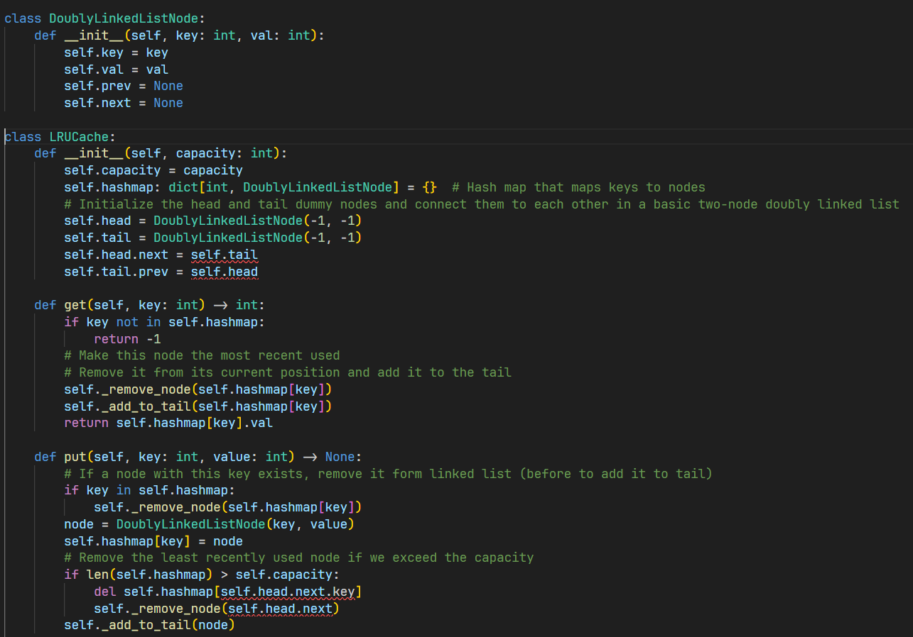
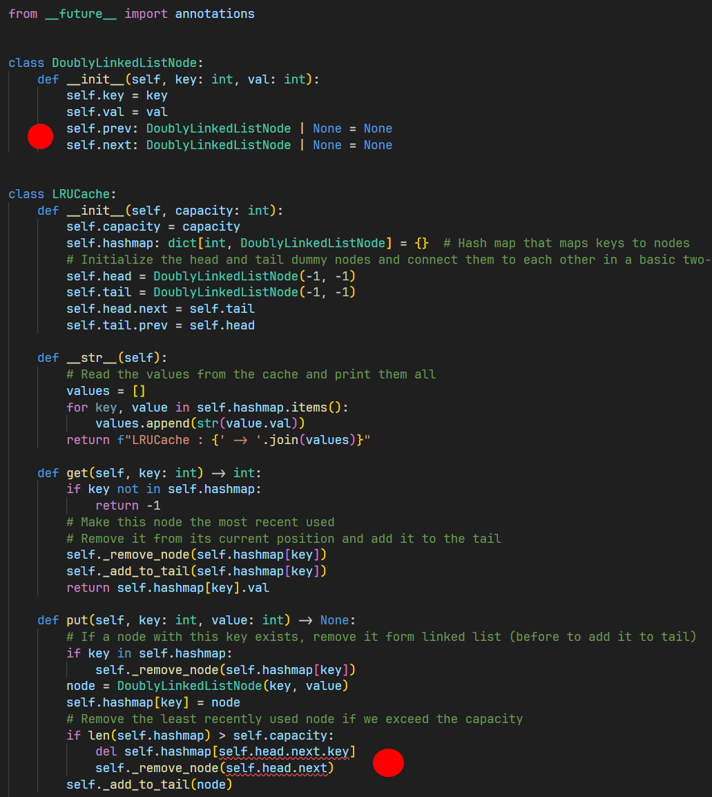
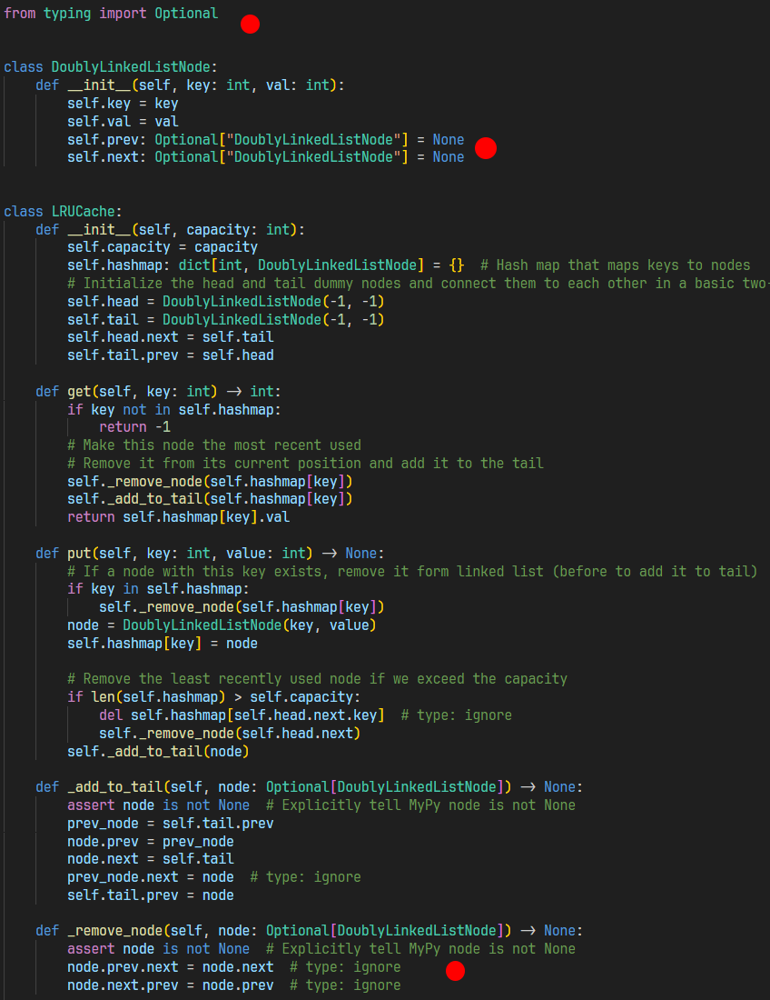
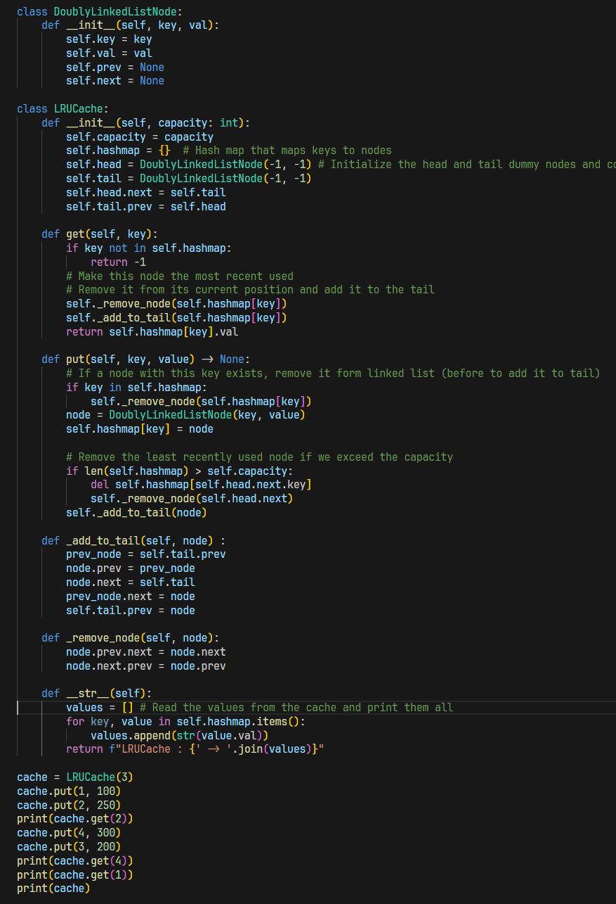

My notes from the book ISBN-10: [1736049135](https://amzn.eu/d/e3MFYEf) 

<div align="center">

</div>


## My Recommendations  
I'm starting my second read of the book.  
After several attempts, I recommend—just like in the good old days—typing the code yourself with your own fingers.  

The problem is that with Copilot, Intellisense, code snippets, etc., a large part of the code can be generated automatically.  
On top of that, MyPy is a real pain in this context.  

Here’s what I finally do:  

1. Open the excellent VSCode  
1. Open a Jupyter Notebook  
1. Type the code in a **Markdown** section  
1. Read it over, review, etc.  
1. Once everything looks good, convert the Markdown cell into a Python cell  
1. Run, debug, etc.  

Finally, I don’t use any type hints anymore because, in this context, MyPy does more harm than good.  
It's better to focus on understanding the different algorithms and data structures rather than spending time bloating/complicating/slowing down the code just to help MyPy understand what's going on (and avoid it throwing insults every five lines).  

Even though I firmly believe that the root issue is Python not being strictly typed. This makes me think of MyPy as a patch on a wooden leg. It does its best to warn you, you try to correct as much warnings as possible but no one really care and you have to run the code to see if works or not. 

I normally use type annotations, but here, honestly… it's a real headache, and it doesn’t help tp focus on what matters.

## Example (see the book p 63)

### Default implementation :
1. Do you see the red squiggles?
1. Do you exactly why they are where they are?
1. Will you learn something solving these issues?

<div align="center">

</div>

### Second attempt :
1. I use `from __future__ import annotations`
1. There are still warnings in the ``put()`` method.

<div align="center">

</div>

### Third attempt :

1. I now use `from typing import Optional` at the top of the code
1. Note the use of strings in the class definition (`self.prev: Optional["DoublyLinkedListNode"] = None`)
1. Do you see the `# type: ignore` comments to "Enjoy the Silence" (🎹, 1980)?
1. In the `_remove_node()` method, note the ``assert``. You then must run ``python -O script.py`` to avoid ``assert`` penalty in "release" version

<div align="center">

</div>

### Jupyter NoteBook Version :

1. The code is working (CTRL+ENTER)
1. The code is in the "spirit" of the book
1. I can focus on what really matters
1. **Bonus :** I can add Markdown cells with my comments. But "perfect is the enemy of good" and I use to spend way too much time polishing the look and adding content to those cells.

<div align="center">

</div>

## Just to make sure...
Don't get me wrong. I really enjoy the benefits of strong typed languages like C++ which detect 90% of the errors at compile time. 

Voici ta phrase traduite en anglais US :

"The thing is, from my perspective, specifically within the context of studying the book's code, we don't have time to waste on anything other than data structures and algorithms. As I demonstrated above, using Python mode (versus Notebook) forces us to add quite a bit of extra code to satisfy MyPy, causing us to lose focus if we want to eliminate its warnings. In short, my recommendation is to work within a Jupyter Notebook.

Below is a C++ version of the LRU Cache code above. Here, no question... Everything must be correctly typed otherwise you have no chance to go through the compile phase.  


```cpp
#include <iostream>
#include <unordered_map>
#include <memory>

struct DoublyLinkedListNode {
    int key;
    int val;
    DoublyLinkedListNode* prev;
    DoublyLinkedListNode* next;
    DoublyLinkedListNode(int k, int v) : key(k), val(v), prev(nullptr), next(nullptr) {}
};

class LRUCache {
public:
    explicit LRUCache(int capacity) : capacity(capacity) { // implicit conversion is forbidden
        head = std::make_unique<DoublyLinkedListNode>(-1, -1);
        tail = std::make_unique<DoublyLinkedListNode>(-1, -1);
        head->next = tail.get();
        tail->prev = head.get();
    }

    int get(int key) {
        if (hashmap.find(key) == hashmap.end()) return -1;
        DoublyLinkedListNode* node = hashmap[key];
        removeNode(node);
        addToTail(node);
        return node->val;
    }

    void put(int key, int value) {
        if (hashmap.find(key) != hashmap.end()) {    
            removeNode(hashmap[key]);
            delete hashmap[key];
            hashmap.erase(key);
        }

        if (hashmap.size() >= capacity) {
            DoublyLinkedListNode* lru = head->next;
            removeNode(lru);
            hashmap.erase(lru->key);
            delete lru;
        }

        DoublyLinkedListNode* newNode = new DoublyLinkedListNode(key, value);
        hashmap[key] = newNode;
        addToTail(newNode);
    }

    ~LRUCache() {
        for (auto& [key, node] : hashmap) {
            delete node;
        }
    }

    friend std::ostream& operator<<(std::ostream& os, const LRUCache& cache) {
        DoublyLinkedListNode* current = cache.head->next;
        std::cout << "LRUCache: ";
        while (current != cache.tail.get()) {
            std::cout << current->val << " ";
            current = current->next;
        }
        std::cout << "\n";
        return os;
    }

private:
    int capacity;
    std::unordered_map<int, DoublyLinkedListNode*> hashmap;
    std::unique_ptr<DoublyLinkedListNode> head;
    std::unique_ptr<DoublyLinkedListNode> tail;

    void addToTail(DoublyLinkedListNode* node) {
        node->prev = tail->prev;
        node->next = tail.get();
        tail->prev->next = node;
        tail->prev = node;
    }

    void removeNode(DoublyLinkedListNode* node) {
        node->prev->next = node->next;
        node->next->prev = node->prev;
    }
};

int main() {
    LRUCache cache(3);
    cache.put(1, 100);
    cache.put(2, 250);
    std::cout << cache.get(2) << "\n"; // 250
    cache.put(4, 300);
    cache.put(3, 200);
    std::cout << cache.get(4) << "\n"; // 300
    std::cout << cache.get(1) << "\n"; // 100
    std::cout << cache;
    return 0;
}
```

